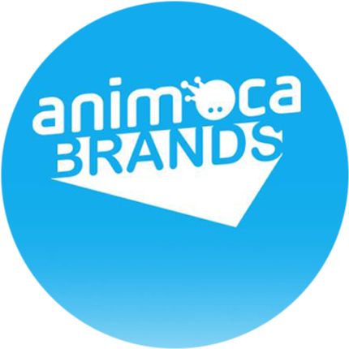
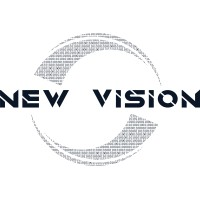

<html lang="en">
<head>
    <meta charset="UTF-8">
    <meta name="viewport" content="width=device-width, initial-scale=1.0">
<!--     <title>Jethro Zhao - Resume</title> -->
    <link href="https://fonts.googleapis.com/css2?family=Libre+Baskerville:wght@400;700&family=Inter:wght@300;400;600&display=swap" rel="stylesheet">
    
</head>
<body>
    

        <header>
            

                <h1>Jethro Zhao</h1>
                

                    
                    
                    
                

            

        </header>

        

            
xiaoyaoj@usc.edu | 🇺🇸 US: +1 (310) 293 5738 | 🇭🇰 HK: +852 9191 1019

        

        <section class="intro">
            
👋 Hey! I'm Jethro -- a data analyst, software engineer, and tennis enthusiast. I'm a current sophomore studying Artificial Intelligence for Business at USC in LA. 

        </section>

        <section class="section" id="experience">
            <h2>Work Experience</h2>
            

                

                    

                        
                    

                    

                        
Data Science Intern

                        
Animoca Brands Limited

                        
June 2024 - August 2024

                    

                

                

                    <ul>
                        <li>Designed and implemented initial dashboard and database for emerging projects using SQL</li>
                        <li>Communicated with 4 prospective clients and partners to design and conduct experiments to evaluate these solutions</li>
                        <li>Performed data wrangling to clean datasets and analysed experiment data using matplotlib</li>
                    </ul>
                

            

            

                

                    

                        
                    

                    

                        
AI Software Intern

                        
New Vision Asset Management Ltd

                        
June 2023 - August 2023

                    

                

                

                    <ul>
                        <li>Developed a program using LLMs to retrieve and analyse equity research reports to generate potential investment opportunities under current market conditions</li>
                        <li>This innovation saved analysts in the company significant time that was otherwise spent reading equity research reports</li>
                    </ul>
                

            

            

                

                    

                         
                    

                    

                        
Junior Reporter & Social Media Manager

                        
South China Morning Post

                        
June 2021 - July 2021

                    

                

                

                    <ul>
                        <li>Conducted interviews & co-wrote 3 articles</li>
                        <li>Compiled reader responses, movie and event news for daily paper</li>
                        <li>Managed Instagram & grew following 14%</li>
                    </ul>
                

            

        </section>

        <section class="section" id="education">
            <h2>Education</h2>
            

                

                    

                        
                    

                    

                        
Bachelor of Science, Artificial Intelligence for Business

                        
University of Southern California

                        
August 2023 - Present

                    

                

                

                    
GPA: 3.8

                    
Pursuing a dual degree program combining business acumen with cutting-edge AI technology

                

            

            

                

                    

                         
                    

                    

                        
Entrepreneurship And Innovation: Changing The World Via Venture Creation

                        
Columbia University

                        
June 2021 - August 2021

                    

                

                

                    
Intensive summer program focused on entrepreneurship and innovation strategies

                    
Developed skills in venture creation and business model innovation

                

            

        </section>

        <section class="section" id="projects">
            <h2>Projects</h2>
            

                

                    
Project Reboot

                    
Collected and recycled 25kg of e-waste. Donated 243 calculators to children in Cambodia.

                

                

                    
Project Privates

                    
Fundraised $3,000 USD for the Hong Kong cancer foundation to promote men's health awareness.

                

                

                    
Bloom Fashion

                    
Founded fashion advisory startup for Hong Kong men, managing 8-member team.

                

            

        </section>
    

</body>
</html>
